# Role-based access control with Quarkus and Microsoft Azure Active Directory

In this article we'll demonstrate how to connect your Quarkus application to Microsoft Azure Active Directory
to authenticate and authorize users. We'll show how you can give users access to certain parts of your 
application by mapping Active Directory groups to application roles.

## Getting started

Create a new quarkus application using the code generation tool at 
[code.quarkus.io](https://code.quarkus.io/?g=no.kantega&a=quarkus-ad&e=resteasy&e=resteasy-qute&e=oidc). Be sure
to select `OpenID Connect` and `RESTEasy Qute`. Click "Generate your application", and download the
generated project as a zip file. 

Decompress and open the project in your favorite IDE. You can then start the application 
by running `./mvnw quarkus:dev`

```
$ ./mvnv quarkus:dev

__  ____  __  _____   ___  __ ____  ______
--/ __ \/ / / / _ | / _ \/ //_/ / / / __/
-/ /_/ / /_/ / __ |/ , _/ ,< / /_/ /\ \
--\___\_\____/_/ |_/_/|_/_/|_|\____/___/
2021-10-08 14:23:46,994 INFO  [io.quarkus] (Quarkus Main Thread) quarkus-ad 1.0.0-SNAPSHOT on JVM (powered by Quarkus 2.3.0.Final) started in 124.864s. Listening on: http://localhost:8080
2021-10-08 14:23:46,996 INFO  [io.quarkus] (Quarkus Main Thread) Profile dev activated. Live Coding activated.
2021-10-08 14:23:47,003 INFO  [io.quarkus] (Quarkus Main Thread) Installed features: [cdi, oidc, qute, resteasy, resteasy-qute, security, smallrye-context-propagation, vertx]
```

Quarkus will generate a class called `SomePage` which has a JAX-RS endpoint mapped to `/some-page`

```java
@Path("/some-page")
public class SomePage {
    private final Template page;

    public SomePage(Template page) {
        this.page = requireNonNull(page, "page is required");
    }

    @GET
    @Produces(MediaType.TEXT_HTML)
    public TemplateInstance get(@QueryParam("name") String name) {
        return page.data("name", name);
    }
}
```

Open http://localhost:8080/some-page and you should see the following page: 

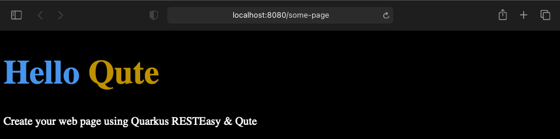

## Authentication with OpenID Connect and Azure Active Directory

To enable OIDC within Active Directory, you need to register your application in the Azure portal. 
Log in to https://portal.azure.com. You can use your personal email address or your github account
to log in. If you do, an empty Active Directory is set up for you. If you log in with your work account, 
you may find that there is already an Active Directory set up, which you may or may not have access 
to configuring. 

After logging in, navigate to the Azure Active Directory control panel using the menu in the top-left corner.
It should look something like this: 

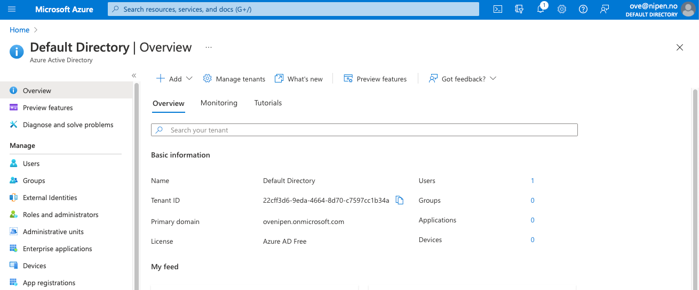

Quarkus needs three parameters to integrate with Active Directory. These are: 

```properties
quarkus.oidc.client-id
quarkus.oidc.credentials.secret
quarkus.oidc.auth-server-url
```

To create the values for these parameters, we first need to register our application with Azure AD. Navigate to 
`Manage/App registrations` in the menu on the left. 

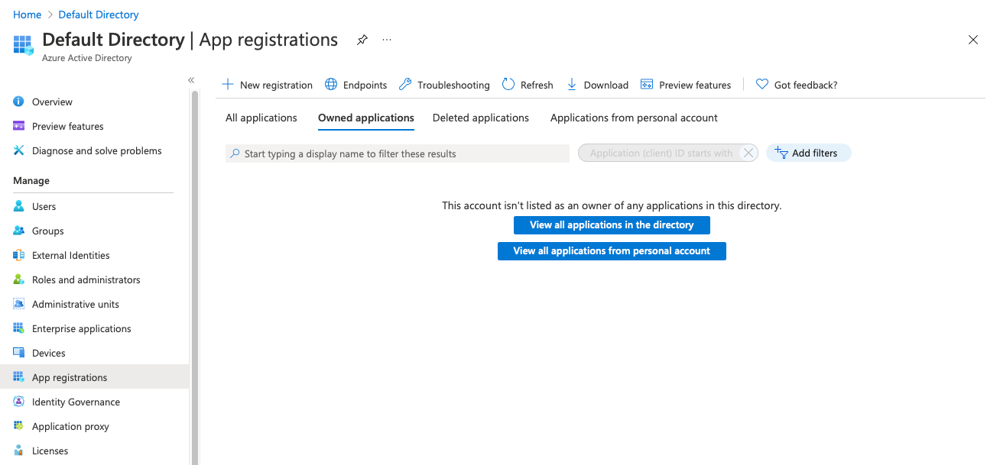

Select `New registration`, and fill inn the form. Use `Quarkus AD` as the application name. We'll also allow
users from any organizational directory to log in. 

Important: Register http://localhost:8080 as a redirect URI. As part of the logon process, users will be 
redirected from our application to Azure AD for authentication. We want to send them back to our application
afterwards. Azure AD will not allow any redirect URLs that are not registered. When you deploy your 
application to another server (not localhost), you will need to add that URL as well. We'll come back to this
later. For now, we'll stick with http://localhost:8080, since this will allow us to test the login flow. 

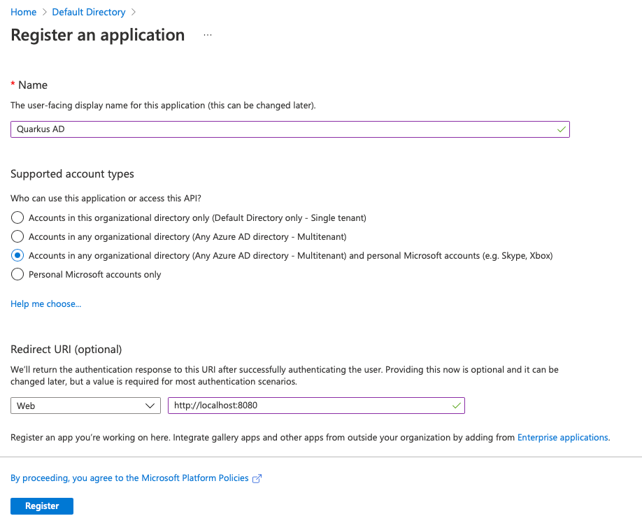

Click register. You should now be able to find the app registration by navigating to `Manage/App registrations`
in the menu on the left. 

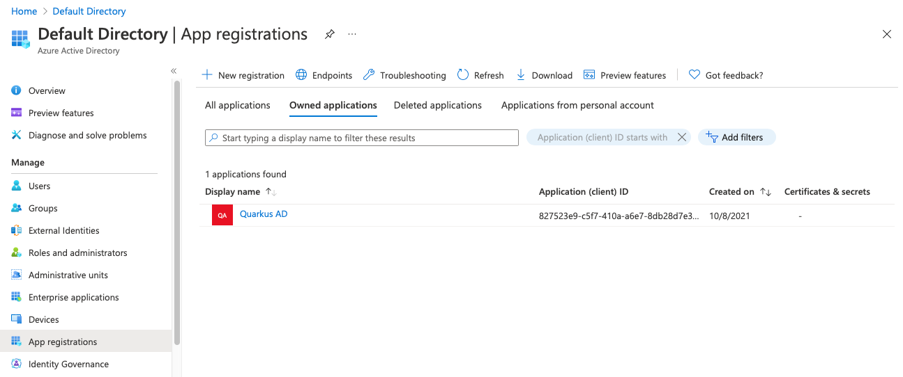

We can now find the parameters we need to set up Quarkus OIDC. Click on `Quarkus AD` to display its details: 

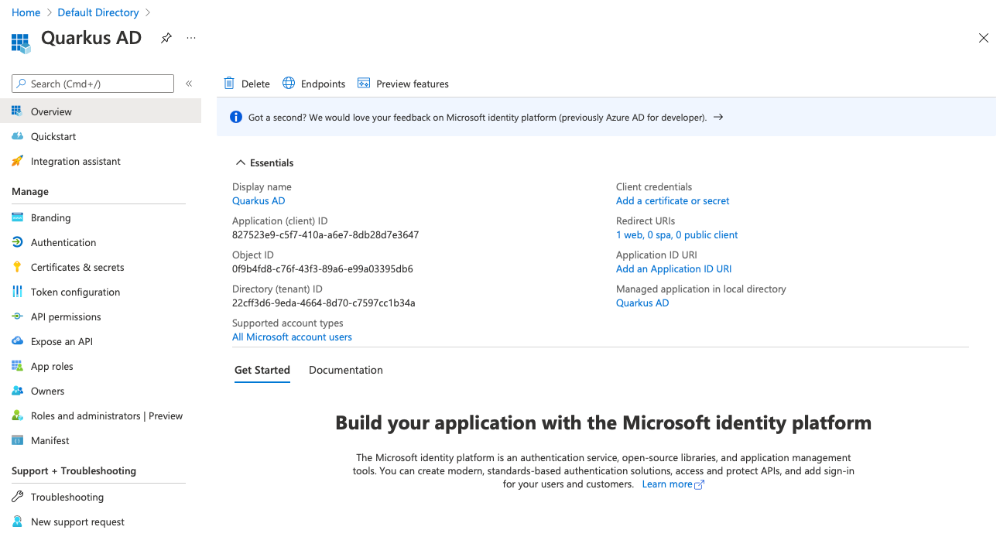

The first value we're looking for is the Application (client) ID. In our case, the value is 
`827523e9-c5f7-410a-a6e7-8db28d7e3647`. Yours will be different. 


Open `application.properties` and add the value for `quarkus.oidc.client-id` 

```properties
quarkus.oidc.client-id=827523e9-c5f7-410a-a6e7-8db28d7e3647
quarkus.oidc.credentials.secret=<todo>
quarkus.oidc.auth-server-url=<todo>
```

Next, click `Add a certificate or secret`, and then `New client secret`. Name it `Quarkus AD client secret` and click `Add`. 

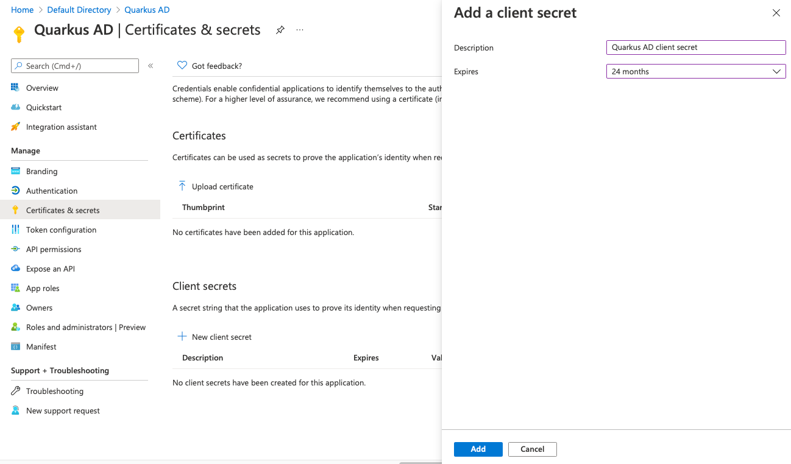

You should then see it in the list of client secrets: 

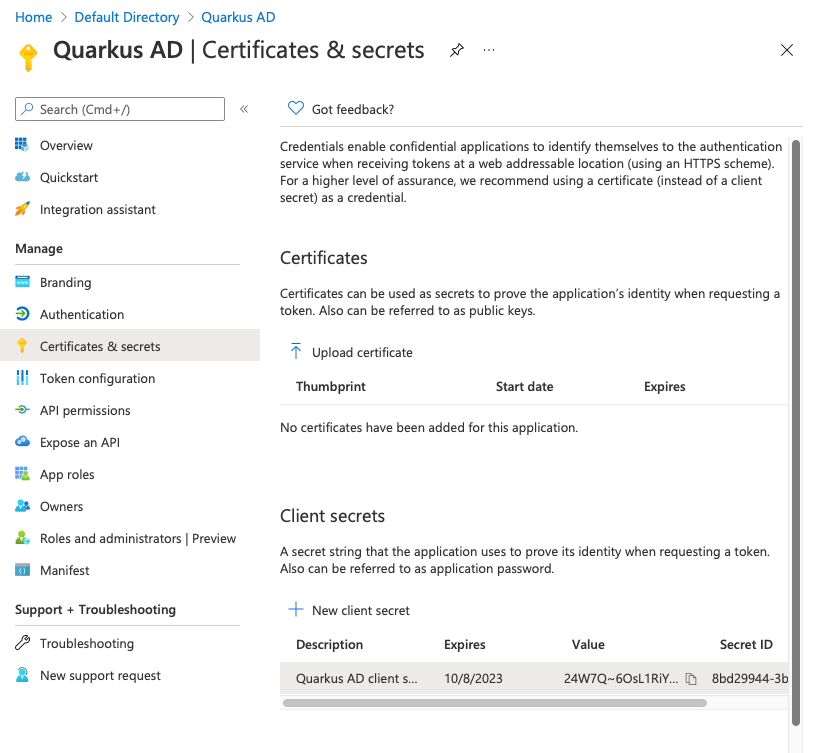

Copy the value (not the ID) to the clipboard using the small copy-button and set `quarkus.oidc.credentials.secret`
to that value. 

```properties
quarkus.oidc.client-id=827523e9-c5f7-410a-a6e7-8db28d7e3647
quarkus.oidc.credentials.secret=<the value you just copied>
quarkus.oidc.auth-server-url=<todo>
```

The last property we need is the Auth Server URL. You'll find that by navigating to `Manage/App registrations`
and selecting `Endpoints`. The value we need is "OpenID Connect Metadata document", but only the part 
up to and including `v2.0`. Quarkus will add `.well-known`, etc, itself. 

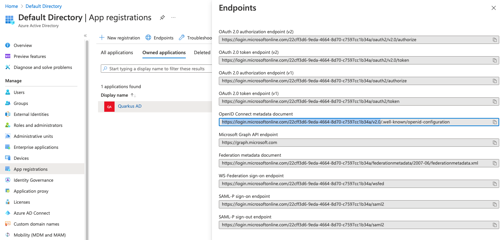

Copy the value and set `quarkus.oidc.auth-server-url` in application.properties:

```properties
quarkus.oidc.client-id=827523e9-c5f7-410a-a6e7-8db28d7e3647
quarkus.oidc.credentials.secret=<not shown>
quarkus.oidc.auth-server-url=https://login.microsoftonline.com/22cff3d6-9eda-4664-8d70-c7597cc1b34a/v2.0
```

Reload http://localhost:8080/some-page. In the console, you should see the application restarting, 
and a line that says that Quarkus is discovering the OpenID Connect configuration 

``` 
2021-10-08 17:15:49,791 INFO  [io.qua.oid.dep.dev.OidcDevConsoleProcessor] (build-5) OIDC Dev Console: discovering the provider metadata at https://login.microsoftonline.com/22cff3d6-9eda-4664-8d70-c7597cc1b34a/v2.0/.well-known/openid-configuration
```

Before we can enable authentication, we first need to set up the redirect URL. By default, Quarkus will ask Azure AD to
redirect the user back to the URL they tried to access before authenticating. However, Azure AD only allows the
application to redirect to a configured list of urls. While there is
[limited support for wildcards](https://docs.microsoft.com/en-us/azure/active-directory/develop/reply-url#restrictions-on-wildcards-in-redirect-uris), 
the safest option is to simply redirect the user to an absolute url, and let Quarkus remember where the user wanted
to go. 

OIDC supports [three different flows](https://www.scottbrady91.com/openid-connect/openid-connect-flows). These
are called _Authorization Code Flow_, _Implicit Flow_ and _Hybrid Flow_. These are mapped to the application
types `WEB-APP`, `SERVICE` and `HYBRID` in Quarkus OIDC. The main difference between these flows is whether
tokens are exposed to the client. In our case, we're developing a server-side rendered web app.

Add the following to `application.properties`:

```properties
quarkus.oidc.application-type=web_app
quarkus.oidc.authentication.redirect-path=/
quarkus.oidc.authentication.restore-path-after-redirect=true
```

To force the user to log on, we need to enable authentication on the endpoint. In `SomePage.java`, add
the `@Authenticated` annotation to the class. After Quarkus OIDC has authenticated the user, a `SecurityIdentity` is
created. Since the page controller is request scoped, it is OK to inject the `SecurityIdentity` as an instance member.
Make sure the page template also has access to the `SecurityIdentity` by adding it to the page data.

```java
@Path("/some-page")
@Authenticated
public class SomePage {
    private final Template page;

    @Inject
    SecurityIdentity identity;

    public SomePage(Template page) {
        this.page = requireNonNull(page, "page is required");
    }

    @GET
    @Produces(MediaType.TEXT_HTML)
    public TemplateInstance get(@QueryParam("name") String name) {
        return page
                .data("name", name)
                .data("identity", identity);
    }
}
```

You can then modify the html template to display the name of the user. In `page.qute.html`, add the following: 

```html
<h1>Hello, {identity.principal.name}</h1>
```

Finally, test it out by navigating to http://localhost:8080/some-page. You should be redirected to Azure AD and
asked to log on. You may also be asked to consent to sharing your data with the application.  

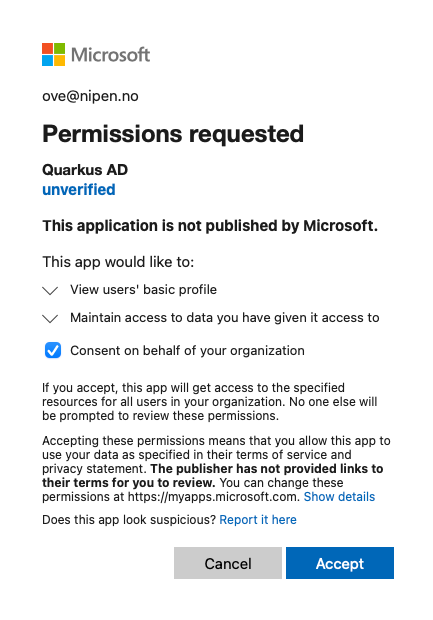

If all went well, you should see this page:


## Debugging Quarkus OIDC

If all did not go well, you need a bit of debugging information. The first thing to do is to enable
debug logging in the Quarkus OIDC plugin. Add the following to your `application.properties`:

```properties
quarkus.log.category."io.quarkus.oidc".min-level=TRACE
quarkus.log.category."io.quarkus.oidc".level=TRACE
```

You may also want to take a look at the actual JWT tokens received from Azure AD. One way to do it, is to
intercept the `SecurityIdentity` creation process by implementing a `SecurityIdentityAugmentor`. I use it 
for logging the tokens as they are received, but you can also use it to add more information to the 
`SecurityIdentity`, for instance by querying a user database or parsing additional claims in the token.

```java
@ApplicationScoped
public class TokenDebugger implements SecurityIdentityAugmentor {
    private final ObjectMapper objectMapper = new ObjectMapper();

    @Override
    public Uni<SecurityIdentity> augment(SecurityIdentity securityIdentity, AuthenticationRequestContext authenticationRequestContext) {
        if (securityIdentity.getPrincipal() instanceof JsonWebToken) {
            JsonWebToken principal = (JsonWebToken) securityIdentity.getPrincipal();

            System.out.println("Received token:");
            for (String part : principal.getRawToken().split("\\.")) {
                String decoded = new String(Base64.decode(part));
                System.out.println(toPrettyJson(decoded));
            }
        }
        return Uni.createFrom().item(securityIdentity);
    }

    private String toPrettyJson(String json) {
        try {
            Object value = objectMapper.readValue(json, Object.class);
            return objectMapper.writerWithDefaultPrettyPrinter().writeValueAsString(value);
        } catch (JsonProcessingException e) {
            return "";
        }
    }
}
```

If you add the `TokenDebugger` class to your project and refresh the page, you should see something like
this on the console: 

```json
Received token:
{
  "typ" : "JWT",
  "alg" : "RS256",
  "kid" : "l3sQ-50cCH4xBVZLHTGwnSR7680"
}
{
  "aud" : "827523e9-c5f7-410a-a6e7-8db28d7e3647",
  "iss" : "https://login.microsoftonline.com/22cff3d6-9eda-4664-8d70-c7597cc1b34a/v2.0",
  "iat" : 1634285978,
  "nbf" : 1634285978,
  "exp" : 1634289878,
  "email" : "ove@nipen.no",
  "idp" : "https://sts.windows.net/9188040d-6c67-4c5b-b112-36a304b66dad/",
  "oid" : "97882ea6-d318-4551-b2cc-eda11a176ad1",
  "rh" : "0.AS8A1vPPItqeZEaNcMdZfMGzSukjdYL3xQpBpueNso1-NkcvAHc.",
  "sub" : "M-ffvMjipQMfYs6nLepEHPTIlUTTqIkXofB3rTIMpmY",
  "tid" : "22cff3d6-9eda-4664-8d70-c7597cc1b34a",
  "uti" : "x2m26gilS0OnFhZN4OowAA",
  "ver" : "2.0"
}
```

## Requesting more information from Active Directory

Looking at the ID token we received above, we can see that the only information we get about the user
is the email address and a few IDs. Our application can ask for more information from the ID provider 
(in this case, Azure AD) by modifying the `scope` parameter sent during login.

By default, Quarkus OIDC requests the `openid` scope from AD, but there are 
[more scopes available](https://auth0.com/docs/configure/apis/scopes/openid-connect-scopes) in all 
OIDC implementations, and you can add custom scopes in most ID providers. For now, we'll ask for the 
three standard scopes, `openid`, `profile` and `email`. By asking for `profile`, we'll get 
basic profile information such as the user's name. 

On the ID provider side of things, we'll need to configure which information to allow 
the application to ask for. In Azure AD, navigate to `App registrations` > `Quarkus AD` >
`Token configuration` and click `Add optional claim`. We want to add `email`, `given_name`, 
and `family name` to the ID token.  

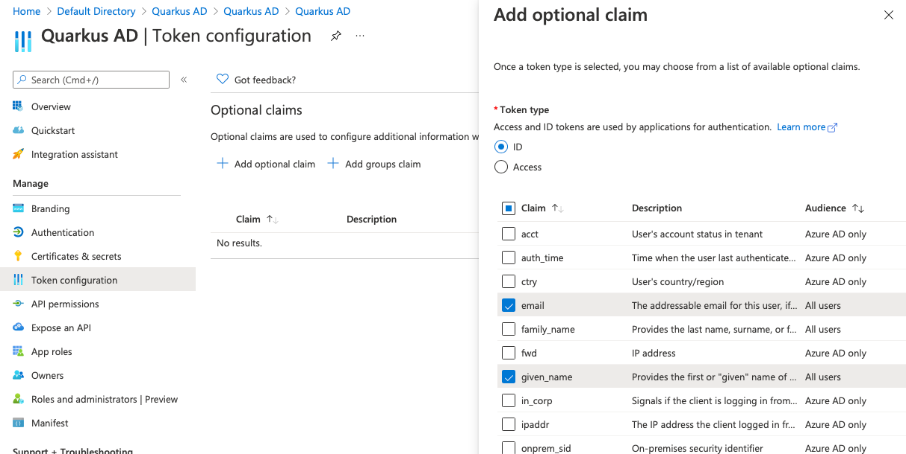

You may be asked to turn on the Microsoft Graph permissions. If so, you need to accept. 

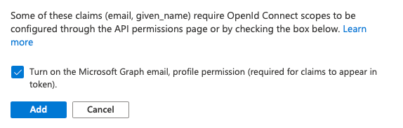

To make Quarkus OIDC ask for the `profile` and `email` scopes, we need to add the following to 
`application.properties`. Note that the `openid` scope is always requested, so we don't need to 
specify it explicitly. 

```properties
quarkus.oidc.authentication.scopes=profile email
```

Reload http://localhost:8080/some-page, and you should see something resembling this in the logs: 

```json
Received token:
{
  "typ" : "JWT",
  "alg" : "RS256",
  "kid" : "l3sQ-50cCH4xBVZLHTGwnSR7680"
}
{
  "aud" : "827523e9-c5f7-410a-a6e7-8db28d7e3647",
  "iss" : "https://login.microsoftonline.com/22cff3d6-9eda-4664-8d70-c7597cc1b34a/v2.0",
  "iat" : 1634299970,
  "nbf" : 1634299970,
  "exp" : 1634303870,
  "email" : "ove@nipen.no",
  "family_name" : "Nipen",
  "given_name" : "Ove",
  "idp" : "https://sts.windows.net/9188040d-6c67-4c5b-b112-36a304b66dad/",
  "name" : "Ove Nipen",
  "oid" : "97882ea6-d318-4551-b2cc-eda11a176ad1",
  "preferred_username" : "ove@nipen.no",
  "rh" : "0.AS8A1vPPItqeZEaNcMdZfMGzSukjdYL3xQpBpueNso1-NkcvAHc.",
  "sub" : "M-ffvMjipQMfYs6nLepEHPTIlUTTqIkXofB3rTIMpmY",
  "tid" : "22cff3d6-9eda-4664-8d70-c7597cc1b34a",
  "uti" : "UuaRzT-VPUyGgNodlWIzAA",
  "ver" : "2.0"
}
```

You can then add some more info to the html page: 

```html 
<h1>Hello, {identity.principal.name}</h1>
<p>
    Given Name: {identity.principal.getClaim("given_name")}
</p>
```

